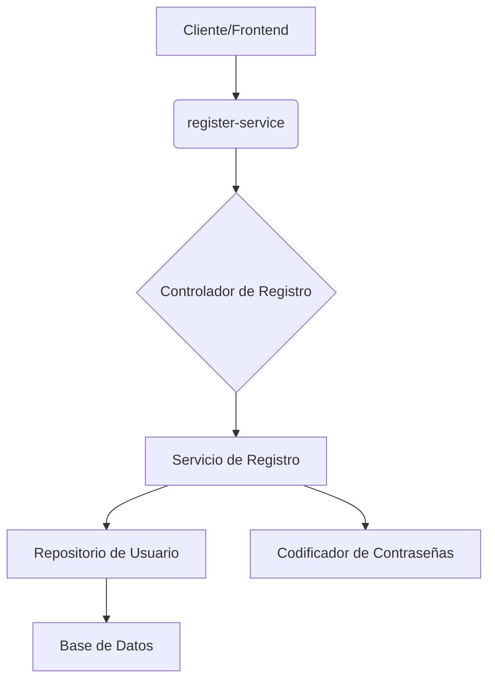

# CodeViz Research Context

> **Note**: This file contains research context from CodeViz. Most recent contexts are at the bottom.

---

## Research Query

crea el diagrama del microservicio register-service

*Session: 7c88b7b7bc3dd26a5473230ab889a6f1 | Generated: 7/3/2025, 9:33:06 AM*

### Analysis Summary

# Diagrama del Microservicio `register-service`

Este informe detalla la arquitectura y el flujo de trabajo del microservicio `register-service`, responsable de la gestión del registro de usuarios en el sistema GreenCommerce.

## Arquitectura General

El microservicio `register-service` es un componente clave dentro del dominio de autenticación del backend. Su propósito principal es manejar el proceso de registro de nuevos usuarios, asegurando la unicidad de los correos electrónicos y la seguridad de las contraseñas.

## Componentes Principales

### **`register-service`** (Microservicio)
Este microservicio es el punto de entrada para todas las operaciones relacionadas con el registro de usuarios.
*   **Propósito**: Gestionar el proceso de registro de nuevos usuarios.
*   **Partes Internas**: Contiene un controlador para manejar las solicitudes HTTP, un servicio para la lógica de negocio, un repositorio para la persistencia de datos y configuraciones de seguridad.
*   **Relaciones Externas**: Interactúa con el cliente/frontend para recibir solicitudes de registro y con una base de datos para almacenar la información del usuario.

### **Controlador de Registro** (`RegisterController`)
El [RegisterController](file:Backend/Domains/Authentication/Register/app/register-service/src/main/java/com/greencommerce/register_service/controller/RegisterController.java) es el componente que expone los endpoints HTTP para el registro de usuarios.
*   **Propósito**: Recibir las solicitudes de registro de usuarios del frontend y delegar la lógica de negocio al servicio de registro.
*   **Partes Internas**: Contiene el método `registerUser` que maneja la solicitud POST.
*   **Relaciones Externas**:
    *   Recibe solicitudes HTTP POST en la ruta `/auth/register` desde el cliente/frontend.
    *   Utiliza el [RegisterService](file:Backend/Domains/Authentication/Register/app/register-service/src/main/java/com/greencommerce/register_service/service/RegisterService.java) para procesar la lógica de registro.

### **Servicio de Registro** (`RegisterService`)
El [RegisterService](file:Backend/Domains/Authentication/Register/app/register-service/src/main/java/com/greencommerce/register_service/service/RegisterService.java) encapsula la lógica de negocio para el registro de usuarios.
*   **Propósito**: Implementar la lógica central para el registro de usuarios, incluyendo la validación, el cifrado de contraseñas y la persistencia de datos.
*   **Partes Internas**: Contiene el método `register` que realiza las operaciones de registro.
*   **Relaciones Externas**:
    *   Depende de [UserRepository](file:Backend/Domains/Authentication/Register/app/register-service/src/main/java/com/greencommerce/register_service/repository/UserRepository.java) para interactuar con la base de datos.
    *   Depende de [PasswordEncoder](file:Backend/Domains/Authentication/Register/app/register-service/src/main/java/com/greencommerce/register_service/security/PasswordEncoderConfig.java) para cifrar las contraseñas de los usuarios.

### **Repositorio de Usuario** (`UserRepository`)
El [UserRepository](file:Backend/Domains/Authentication/Register/app/register-service/src/main/java/com/greencommerce/register_service/repository/UserRepository.java) es la capa de acceso a datos para las entidades de usuario.
*   **Propósito**: Proporcionar métodos para interactuar con la base de datos para las operaciones CRUD (Crear, Leer, Actualizar, Eliminar) de usuarios.
*   **Partes Internas**: Extiende `JpaRepository`, lo que le proporciona métodos predefinidos para la persistencia. Incluye un método personalizado `findByEmail` para buscar usuarios por correo electrónico.
*   **Relaciones Externas**: Interactúa directamente con la base de datos para almacenar y recuperar información de usuarios.

### **Configuración de Seguridad** (`SecurityConfig` y `PasswordEncoderConfig`)
Estos componentes gestionan la seguridad del microservicio, incluyendo el cifrado de contraseñas y la configuración de acceso.
*   **Propósito**: Asegurar que las contraseñas de los usuarios se almacenen de forma segura y que los endpoints estén protegidos adecuadamente.
*   **Partes Internas**:
    *   [PasswordEncoderConfig](file:Backend/Domains/Authentication/Register/app/register-service/src/main/java/com/greencommerce/register_service/security/PasswordEncoderConfig.java): Configura el `BCryptPasswordEncoder` para el cifrado de contraseñas.
    *   [SecurityConfig](file:Backend/Domains/Authentication/Register/app/register-service/src/main/java/com/greencommerce/register_service/security/SecurityConfig.java): Define las reglas de seguridad, como la habilitación de CORS, la deshabilitación de CSRF y la configuración de acceso para los endpoints (por ejemplo, `/auth/register` es accesible para todos).
*   **Relaciones Externas**: El `PasswordEncoder` es utilizado por el [RegisterService](file:Backend/Domains/Authentication/Register/app/register-service/src/main/java/com/greencommerce/register_service/service/RegisterService.java) para cifrar contraseñas.

## Flujo de Registro de Usuario

1.  **Solicitud del Cliente**: Un cliente (frontend) envía una solicitud HTTP POST a `/auth/register` con los datos del nuevo usuario.
2.  **Controlador de Registro**: El [RegisterController](file:Backend/Domains/Authentication/Register/app/register-service/src/main/java/com/greencommerce/register_service/controller/RegisterController.java) recibe la solicitud y la delega al [RegisterService](file:Backend/Domains/Authentication/Register/app/register-service/src/main/java/com/greencommerce/register_service/service/RegisterService.java).
3.  **Servicio de Registro**:
    *   El [RegisterService](file:Backend/Domains/Authentication/Register/app/register-service/src/main/java/com/greencommerce/register_service/service/RegisterService.java) primero consulta al [UserRepository](file:Backend/Domains/Authentication/Register/app/register-service/src/main/java/com/greencommerce/register_service/repository/UserRepository.java) para verificar si ya existe un usuario con el correo electrónico proporcionado.
    *   Si el correo electrónico ya está en uso, se lanza una excepción.
    *   Si el correo electrónico es único, el servicio utiliza el [PasswordEncoder](file:Backend/Domains/Authentication/Register/app/register-service/src/main/java/com/greencommerce/register_service/security/PasswordEncoderConfig.java) para cifrar la contraseña del usuario.
    *   Finalmente, el servicio utiliza el [UserRepository](file:Backend/Domains/Authentication/Register/app/register-service/src/main/java/com/greencommerce/register_service/repository/UserRepository.java) para guardar el nuevo usuario (con la contraseña cifrada) en la base de datos.
4.  **Respuesta**: El [RegisterController](file:Backend/Domains/Authentication/Register/app/register-service/src/main/java/com/greencommerce/register_service/controller/RegisterController.java) devuelve una respuesta al cliente indicando el éxito o fracaso del registro.

### Implementation Steps

1. **Understanding the Overall Architecture of `register-service`**
   The `register-service` is a core component within the authentication domain of the GreenCommerce system. Its primary role is to manage the registration of new users, ensuring email uniqueness and password security. It interacts with the client/frontend and a database.

2. **Exploring the `register-service` Microservice**
   The `register-service` microservice acts as the entry point for all user registration operations. Its purpose is to manage the new user registration process. Internally, it comprises a controller for handling HTTP requests, a service for business logic, a repository for data persistence, and security configurations. It communicates with the client/frontend to receive registration requests and with a database to store user information.

3. **Delving into the Register Controller**
   The `RegisterController` is responsible for exposing HTTP endpoints for user registration. Its purpose is to receive user registration requests from the frontend and delegate the business logic to the registration service. It contains a method to handle POST requests and relies on the `RegisterService` to process the registration logic.

4. **Examining the Register Service**
   The `RegisterService` encapsulates the business logic for user registration. Its purpose is to implement the central logic for user registration, including validation, password encryption, and data persistence. It depends on the `UserRepository` for database interaction and on a `PasswordEncoder` for encrypting user passwords.

5. **Understanding the User Repository**
   The `UserRepository` serves as the data access layer for user entities. Its purpose is to provide methods for interacting with the database for user CRUD (Create, Read, Update, Delete) operations. It extends a base repository, providing predefined persistence methods, and includes a custom method to find users by email. It directly interacts with the database to store and retrieve user information.

6. **Reviewing Security Configuration**
   The security components, including `SecurityConfig` and `PasswordEncoderConfig`, manage the microservice's security. Their purpose is to ensure that user passwords are securely stored and that endpoints are properly protected. `PasswordEncoderConfig` configures the password encoder for encryption, while `SecurityConfig` defines security rules like enabling CORS, disabling CSRF, and configuring access for endpoints. The `PasswordEncoder` is utilized by the `RegisterService` for password encryption.

7. **Understanding the User Registration Flow**
   The user registration flow begins with a client (frontend) sending an HTTP POST request to the `/auth/register` endpoint with new user data. The `RegisterController` receives this request and delegates it to the `RegisterService`. The `RegisterService` first checks the `UserRepository` to ensure the email is unique; if not, an exception is thrown. If unique, the service uses the `PasswordEncoder` to encrypt the password and then saves the new user (with the encrypted password) to the database via the `UserRepository`. Finally, the `RegisterController` sends a response back to the client indicating the success or failure of the registration.

